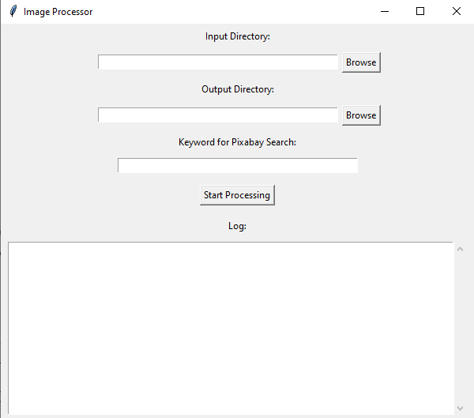

# Image Processor GUI

## 🎨 Overview

The **Image Processor GUI** is a Python-based desktop application that simplifies working with images. It enables users to:

- **Search and download images** from Pixabay based on a keyword.
- **Process image files** (both JPG and PNG) with options to convert between formats.
- **Maintain directory structures** while ensuring no duplicate outputs.
- **Resize and store images** based on dimensions from input files.

This application includes a user-friendly GUI for seamless interaction and is packaged as an installable `.exe` file for easy distribution.

## Screenshots



---

## ✨ Features

- **JPG and PNG Support**: Handles both `.jpg` and `.png` files, converting formats as necessary.
- **Pixabay Integration**: Downloads high-quality images from Pixabay using their API.
- **Unique Outputs**: Ensures no duplicate images in the output folder.
- **GUI-Based Interaction**: No need to modify code—operate through an intuitive graphical user interface.
- **Preserves Directory Structure**: Replicates the input folder structure for output files.

---

## 📂 Project Structure

```plaintext
.
├── image_processor_gui.py   # Main Python script
├── requirements.txt         # Python dependencies
├── README.md                # Documentation
└── dist/                    # Folder containing the compiled executable
```

---

## 🔧 Installation

### Prerequisites

- Python 3.8+
- Internet connection (for Pixabay API)

### Steps to Install

1. Clone the repository:
   ```bash
   git clone https://github.com/your-username/image-processor-gui.git
   cd image-processor-gui
   ```
2. Install dependencies:
   ```bash
   pip install -r requirements.txt
   ```
3. Run the application:
   ```bash
   python image_processor_gui.py
   ```
4. To use the `.exe` file (optional):
   - Navigate to the `dist/` folder.
   - Double-click `image_processor_gui.exe` to launch the application.

---

## 🖥️ Usage

1. **Launch the Application**:

   - If running via Python: Execute `python image_processor_gui.py`.
   - If using the `.exe` file: Double-click the executable.

2. **Choose Input and Output Directories**:

   - Specify the folder containing input images.
   - Select the output folder where processed files will be saved.

3. **Enter a Keyword**:

   - Provide a keyword to search for relevant images on Pixabay.

4. **Start Processing**:

   - Click the `Process Images` button to begin downloading, resizing, and saving images.

5. **View Results**:
   - Processed images are saved in the output directory, maintaining the input folder's structure.

---

## 🚀 Purpose

### Why This Tool?

The **Image Processor GUI** was created to solve key challenges faced by professionals who deal with large volumes of images:

- **Time-Consuming Image Management**: Designers and developers often need to resize, convert, and organize images while preserving structure. This tool automates those tasks.
- **Finding High-Quality Visuals**: Integrating Pixabay ensures access to copyright-friendly, high-quality images, eliminating manual search efforts.
- **Avoiding Redundancy**: Duplicate images can clutter directories and waste storage. This application ensures unique outputs every time.

### Ideal Use Cases

- **Design Agencies**: Quickly resize and organize images for multiple projects.
- **Web Developers**: Automate image processing for website assets.
- **Content Creators**: Find and prepare visuals for blogs, videos, or presentations.

By combining automation with user-friendliness, the tool saves valuable time and effort while ensuring professional results.

---

## 🖼️ Screenshots

### Main Interface


---

## 🛠️ Building the Executable

To package the project as an `.exe` file:

1. Install PyInstaller:
   ```bash
   pip install pyinstaller
   ```
2. Run the following command:
   ```bash
   pyinstaller --onefile --windowed image_processor_gui.py
   ```
3. Locate the `.exe` file in the `dist/` directory.

---

## 📜 License

This project is licensed under the **MIT License**. Feel free to modify and distribute it as per the license terms.

---

## 🤝 Contributing

Contributions are welcome! To contribute:

1. Fork the repository.
2. Create a feature branch:
   ```bash
   git checkout -b feature-name
   ```
3. Commit your changes and push the branch:
   ```bash
   git push origin feature-name
   ```
4. Open a pull request.

---

## 📝 Acknowledgments

- **Pixabay** for providing a robust image API.
- **Pillow (PIL)** for image manipulation.
- The open-source community for their invaluable tools and libraries.

---

## 📧 Contact

For questions or feedback, please reach out to:

- **Email**: salimreza6835@gmail.com
- **GitHub**: [srj101](https://github.com/srj101)

---

Happy Processing! 🎉
